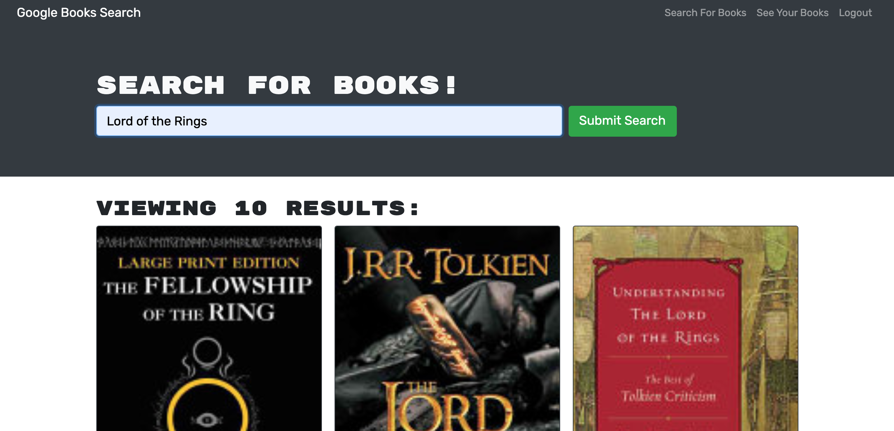

# book-search

## Purpose
Book Search allows all users to search the Google books API for books they might be interested in and then save those books into their favorites page. 

## Built With
* Javascript
* mongodb
* mongoose ODM
* express.js
* Node.js
* React
* Apollo Server
* Google Books API

## Link
https://glacial-everglades-85156.herokuapp.com/ 

## Contribution
Made by Mike Portu
